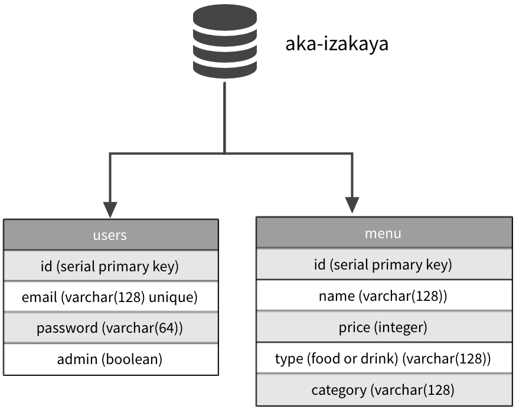

# Aka-Izakaya

sei-anz-seifxr06 - Project 3 - [Live Version](https://aka-izakaya.herokuapp.com/)

## Design Brief

- Japanese Resturant that has the ability to show customers the food and drinks menu. This website also has a Admin portal that gives the client the ability to "CRUD" the menu items.

## Technologies Used

- Node JS
- Express JS
- Postgres
- Bootstrap

## User Stories

- A Customer wants to read a drinks list to decide what drinks to order prior to coming to our resturant
- A Customer wants to read a food menu to decide what food to order prior to coming to our resturant
- The Client wants to create, read, update, delete the drinks list to update the main website
- The Client wants to create, read, update, delete the food menu to update the main website

## Database

## Wireframe Design

- [Main Page](./client/assets/readme/main-page.webp)
- [Drinks Menu](./client/assets/readme/drinks-menu.webp)
- [Food Menu](./client/assets/readme/food-menu.webp)
- [Contact Page](./client/assets/readme/contact.webp)
- [Admin Page](./client/assets/readme/admin.webp)

## Stle Guide

### Font

- Primary logo font - [Long Cang](https://fonts.google.com/specimen/Long+Cang)
- All other fonts are using Bootstrap's default fonts.

### Colours

- Bootstrap default colours classes (.text-light, .text-white, .navbar-dark)

### CSS Framework

[Bootstrap](https://getbootstrap.com/)
